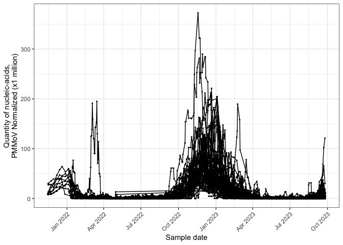
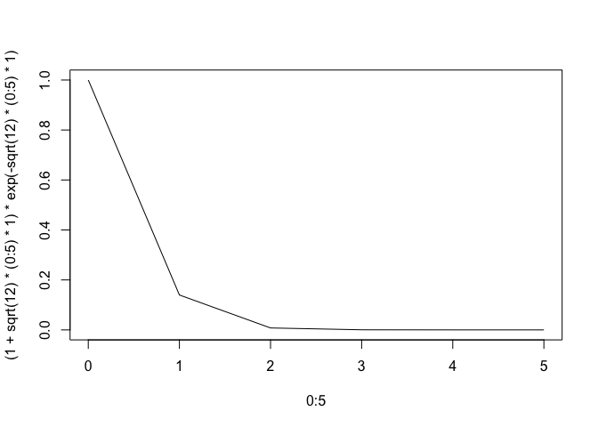
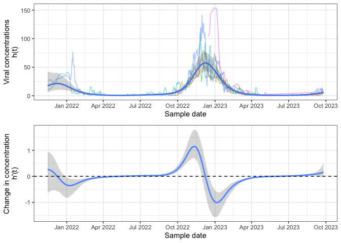
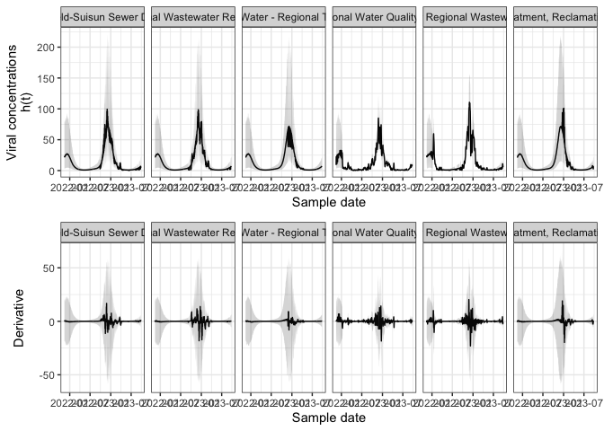

<!-- README.md is generated from README.Rmd. Please edit that file -->

# WastewaterSmoothing

<!-- badges: start -->
<!-- badges: end -->

The goal of the `WastewaterSmoothing` package is

## Installation

You can install the development version of

## Example

First we compile the cpp:

    #> Warning in readLines(file): incomplete final line found on './src/
    #> 00_Gamma_daily_AR2_deriv.cpp'
    #> [1] 0

We consider the following data set of respiratory syncytial viral (RSV)
in California, which is available from the WastewaterSCAN Dashboard

``` r
#library(WastewaterSmoothing)
load('./data/california_rsv.rda')

head(work_d)
#> # A tibble: 6 × 18
#>   sample_id sample_date dilution bcov_recovery bcov_recovery_lci
#>   <chr>     <date>         <dbl>         <dbl>             <dbl>
#> 1 COD110188 2021-11-15         1         0.857             0.802
#> 2 COD110149 2021-11-20         1         0.709             0.662
#> 3 COD110156 2021-11-27         1         0.919             0.754
#> 4 COD110172 2021-12-06         1         0.909             0.842
#> 5 COD110206 2021-12-13         1         0.598             0.554
#> 6 COD110187 2021-12-18         1         1.29              1.17 
#> # ℹ 13 more variables: bcov_recovery_uci <dbl>, name <chr>, site_id <chr>,
#> #   sewershed_pop <dbl>, RSV_num_wells <dbl>, RSV_gc_g_dry_weight <dbl>,
#> #   RSV_gc_g_dry_weight_lci <dbl>, RSV_gc_g_dry_weight_uci <dbl>,
#> #   RSV_gc_g_dry_weight_pmmov <dbl>, RSV_gc_g_dry_weight_pmmov_lci <dbl>,
#> #   RSV_gc_g_dry_weight_pmmov_uci <dbl>, RSV_gc_g_dry_weight_trimmed5 <dbl>,
#> #   RSV_gc_g_dry_weight_trimmed5_pmmov <dbl>
```

``` r
#####################
# Data dictionary
####################

#sewershed_pop: Human population contribution to the sewershed of the collection site
#RSV_gc_g_dry_weight: Copies of RSV RNA per gram of dried solid
#RSV_gc_g_dry_weight_pmmov: Normalized
#RSV_gc_g_dry_weight_trimmed5_pmmov: Probably a cleaner version of the data.

gg <- work_d %>%
  ggplot(aes(sample_date,RSV_gc_g_dry_weight_trimmed5_pmmov*1000000,group = site_id))+
  geom_point(size=0.3)+
  geom_line()+
  theme_bw()+
  scale_y_continuous(name = "Quantity of nucleic-acids,\nPMMoV Normalized (x1 million)", breaks = scales::pretty_breaks(n=5))+
  scale_x_date(breaks=scales::pretty_breaks(n=10), name = "Sample date") +
  theme(axis.text.x = element_text(angle = 45, hjust=1))+ 
  theme(legend.position="bottom")
gg
```



``` r
plot(0:5,(1+sqrt(12)*(0:5)*1)*exp(-sqrt(12)*(0:5)*1),type="l")
```



The model can

    #> lpW: 95.3123
    #> lpAInitial: 1.37021
    #> lpAInitial: 225.059
    #> lpAInitial: 397.926
    #> lpAInitial: 509.123
    #> lpAInitial: 1635.15
    #> lpAInitial: 2397.11
    #> lpAInitial: 2507.57
    #> lpT: -11.8682
    #> prior_c_log: -0.918939
    #> ll: -21034.3
    #> logpost: 12700.8
    #> lpW: 95.3123
    #> lpAInitial: 1.37021
    #> lpAInitial: 225.059
    #> lpAInitial: 397.926
    #> lpAInitial: 509.123
    #> lpAInitial: 1635.15
    #> lpAInitial: 2397.11
    #> lpAInitial: 2507.57
    #> lpT: -11.8682
    #> prior_c_log: -0.918939
    #> ll: -21034.3
    #> logpost: 12700.8
    #> lpW: 95.3123
    #> lpAInitial: 1.37021
    #> lpAInitial: 225.059
    #> lpAInitial: 397.926
    #> lpAInitial: 509.123
    #> lpAInitial: 1635.15
    #> lpAInitial: 2397.11
    #> lpAInitial: 2507.57
    #> lpT: -11.8682
    #> prior_c_log: -0.918939
    #> ll: -21034.3
    #> logpost: 12700.8
    #> lpW: 95.3123
    #> lpAInitial: 1.37021
    #> lpAInitial: 225.059
    #> lpAInitial: 397.926
    #> lpAInitial: 509.123
    #> lpAInitial: 1635.15
    #> lpAInitial: 2397.11
    #> lpAInitial: 2507.57
    #> lpT: -11.8682
    #> prior_c_log: -0.918939
    #> ll: -21034.3
    #> logpost: 12700.8
    #> lpW: 95.3123
    #> lpAInitial: 1.37021
    #> lpAInitial: 225.059
    #> lpAInitial: 397.926
    #> lpAInitial: 509.123
    #> lpAInitial: 1635.15
    #> lpAInitial: 2397.11
    #> lpAInitial: 2507.57
    #> lpT: -11.8682
    #> prior_c_log: -0.918939
    #> ll: -21034.3
    #> logpost: 12700.8
    #> lpW: 95.3123
    #> lpAInitial: 1.37021
    #> lpAInitial: 225.059
    #> lpAInitial: 397.926
    #> lpAInitial: 509.123
    #> lpAInitial: 1635.15
    #> lpAInitial: 2397.11
    #> lpAInitial: 2507.57
    #> lpT: -11.8682
    #> prior_c_log: -0.918939
    #> ll: -21034.3
    #> logpost: 12700.8

    #> [1] 8848
    #> [1] 8848
    #>  [1] 1.038188 1.039384 1.040979 1.041899 1.042679 1.043588 1.044010 1.044268
    #>  [9] 1.044349 1.044194
    #>  [1] 0.2424176 0.2694034 0.3149291 0.3488929 0.3857964 0.4469153 0.4915215
    #>  [8] 0.5390282 0.6153037 0.6689835




